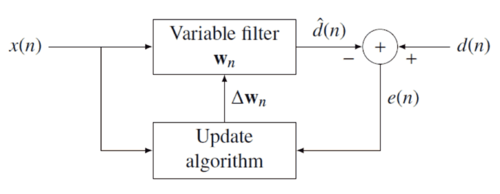
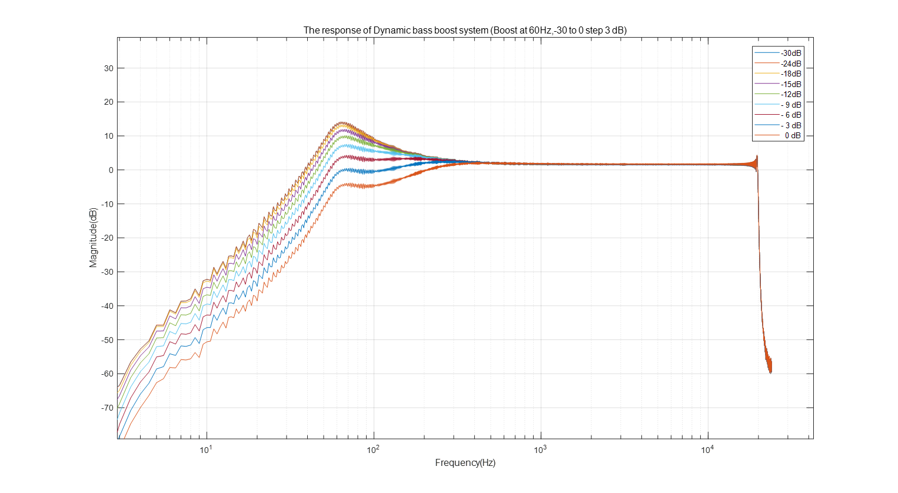

# Nonlinear audio system identification

This is a tool that finds the impulse response of a nonlinear system, it can be used in the audio system with a nonlinear processor, .e.g. audio limiter, compressor.

The identification algorithm is based on exponential sine sweep, ESS, signal and aims to find the impulse response of the tested system, which can be treat as a `black box`.

## Usage

1. Generate the exponential sine sweep signal

   ```C++
   	float fs = 48e3;
   	float f1 = 1;
   	float f2 = 20e3;
   	float duration = 1;
   	size_t len = duration * fs;
   	float* ess = generateExpSineSweep(duration, f1, f2, fs);
   ```

   The ESS signal start from `f1` to `f2` Hz, the duration is `duration` s with a sample rate of `fs` Hz.

2. Then feed the ESS signal into a tested system. For example, we can let the ESS signal pass a low-pass filter for a test.

```c++
float* yFiltered = (float*)malloc(sizeof(float)*len);	
float coefs[2][3] = { 
		{ 0.00391612666054739,	0.00783225332109477,	0.00391612666054739} ,
		{ 1, - 1.81534108270457,	0.831005589346757 }
	};
	Biquad* filter = createBiquad(fs,coefs[0],coefs[1]);
	for (size_t n = 0; n < len; n++)
	{
		runBiquad(filter, ess[n], yFiltered[n]);
	}
```

3. Find impulse response of the tested system.

   ```c++
   float* mag_db =  findSystemIR(yFiltered, duration, f1,f2, fs,ir);
   ```

   Now, the `mag_db ` is the frequency response of the system's impulse response and `ir` is the impulse response. You can export the `mag_db` and `ir` and use MATLAB to plot them. `ir`  has been normalized and the length of `mag_db` is N_ir/2 + 1. So you can use below consoles to plot the frequency response:

   ```matlab
   mag_db = load('mag_db.txt')
   fs=48e3;% the samplerate of ESS
   len = length(mag_db);
   sys_freq = linspace(1,fs/2,len);
   hold on;semilogx(sys_freq,smooth(mag_db));grid on;
   ```

In the other hand, you can use the method to test a dark box system and check the frequency response.


## example 

At this part, we will show how to detect a practical system. Assume the model of the system is to change the output following the magnitude of the input, just like this:



Now we can enter different magnitude ESS signals generated from `generateExpSineSweep()` function. And then record the output of the system. Usually, the model is a c function translates from your MATLAB code. Finally, use the `findSystemIR()` function to capture the impulse response of different input, then analysis and check the result. Below is the frequency response of a dynamic bass boost EQ system tested by this tool:



